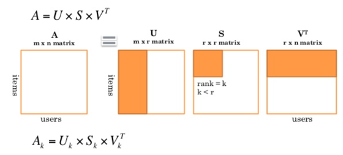

```{r load_packages, message=FALSE, echo=F}
library(recommenderlab)
```  

##Singular Value Decomposition Overview  

Rather than using some of the methods explored in previous projects, we can make recommendations to users by estimating the blank entries (unrated items) by using Singular Value Decomposition (SVD).  Because most utility matrices used in recommendation systems are quite large with a high level of sparsity, using a dimensionality reduction technique like SVD allows for an approximate representation of of the matrix while retaining the most important parts.  

Performing SVD on the original ratings matrix ($M$) will result in three different matrices:  

* $U$, an $m \times r$ matrix, where $r$ is the rank of the utility matrix and the values correspond to the rows. $U$ is also made up of the eigenvectors of $MM^T$.
* $\Sigma$, a diagonal matrix where all elements not on the diagonal are 0, and those on the diagonal are the singular values of the original matrix, sorted in descending order. These singular values are also the square roots of the eigenvalues of $M^TM$ or $MM^T$. The size of the matrix is $r \times r$, however, a reduced number of "concepts" can be used by using smaller rank value ($k$).
* $V$, an $n \times r$ matrix, whole values correspond to the columns of the utility matrix, and is made up of the eigenvectors of $M^TM$. $V$ is always used in its transposed form, $V^T$.  

  

##MovieLense Example

For this project, we'll continue to look at the included `MovieLense` data from the `recommenderlab` package.  

```{r}
data("MovieLense")
#dense_ratings <- MovieLense[rowCounts(MovieLense) > 25, colCounts(MovieLense) > 100]
#dense_ratings
```  

###SVD and Sparse Matrices  

Using the custom function below, we can see that the data is quite sparse in the `MovieLense` set, with only approximately 6.3% of the data containing ratings. One of the issues with SVD is that the matrix cannot contain any missing values, so different methods of imputation (filling with mean or zeros, for example) must be used.  

```{r}
sparsity <- function(ratings){
  nratings(ratings) / (dim(ratings)[1] * dim(ratings)[2])
}

sparsity(MovieLense)
```  

Utilzing the `normalize` function, and then filling in the missing values with 0s (which are now the mean value), we can use SVD on the MovieLense data:  

```{r}
movies_normalized <- normalize(MovieLense)
movies_norm <- as(movies_normalized, "matrix")

movies_norm[is.na(movies_norm)] <- 0

movies_norm[1:5, 1:5]
```  

##SVD with Normalized Matrix  

Using base R's `svd` function, we can run it on the matrix above, and obtain the $U$, $V$, and $\Sigma$ matrices.  

```{r}
movies_svd <- svd(movies_norm)

u <- movies_svd$u
v <- movies_svd$v
sigma <- Diagonal(x = movies_svd$d)  # svd$d is only a vector, need Diagonal to turn into a matrix
```  

To obtain the predicted values of user/item pairs, the following equation is used:  

$U_k(\sqrt(\Sigma)^T)(\sqrt(\Sigma)V_k^T$  

The first part of the equation results in the $m \times k$ matrix, and the second part, the $n \times k$ matrix. Again, $k$ is the number of singular values, and in the example below, the full rank (all singular values) matrix is used. According to the text (Mining of Massive Datasets, pp. 424), the sum of squares of the singular values that equal 90% of the sum of all the squares of singular values hsould be used.  

```{r}
R <- (u %*% t(sqrt(sigma))) %*% (sqrt(sigma) %*% t(v))
R[1:5, 1:5]
``` 

In order to predict ratings for a new user, the vector of ratings for the new user would be mapped to the $V$ matrix given by SVD, rather than comparing the new user to all of the other users as done with previous methods.  

##RMSE of SVD  

The RMSE of the matrix created by SVD can be calculated by using the same formula as before, but just subtracting the difference of the original matrix.  

```{r}
RMSE <- function(rec_mat, orig_mat){
  size <- dim(rec_mat)[1] * dim(rec_mat)[2]
  se <- sum((rec_mat - orig_mat)^2)
  e_val <- se / size
  rmse <- sqrt(e_val)
  return(rmse)
}
```  

Here, we find the RMSE to be very low. However, this is probably a result of how the matrix was normalized, and the method of imputation for the missing values that was used, so we may have some overfitting of the data. Using different combinations of normalizing (centering or z-score), imputation of misisng values (mean of user scores, mean of item scores, overall mean, or zeros), and the $k$ value used for the optimal number of singular values for the $Sigma$ (diagonal) matrix should result in the best estimation of missing values to make recommendations.  